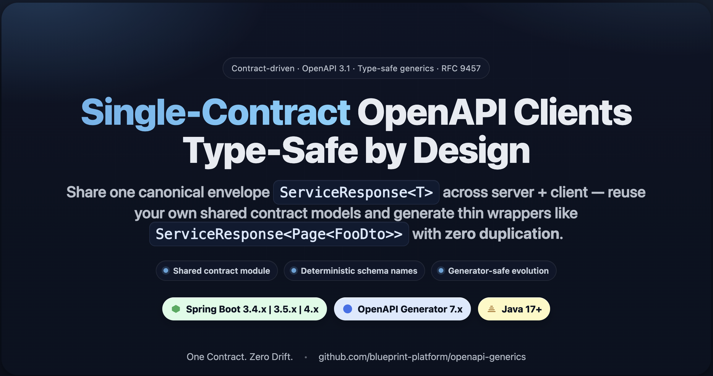
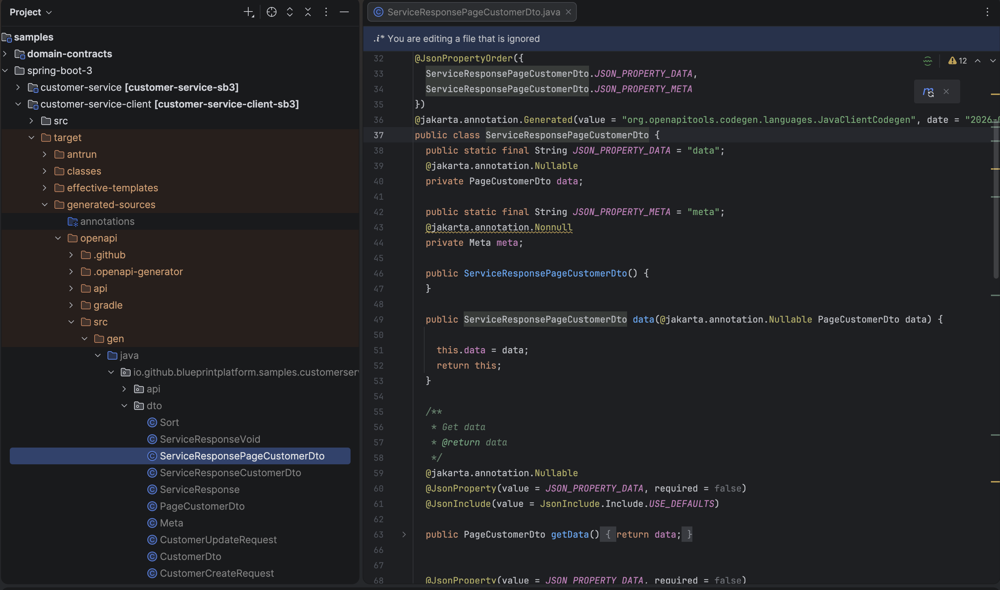
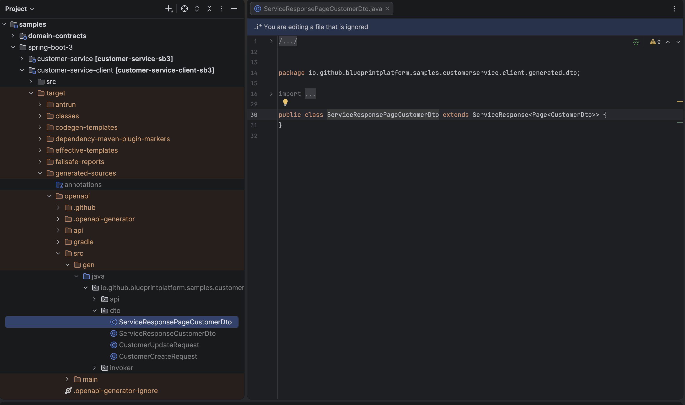

# OpenAPI Generics for Spring Boot — Keep Your API Contract Intact End-to-End

[](https://github.com/blueprint-platform/openapi-generics/actions/workflows/build.yml)
[](https://github.com/blueprint-platform/openapi-generics/actions/workflows/codeql.yml)
[](https://codecov.io/gh/blueprint-platform/openapi-generics)
[](https://github.com/blueprint-platform/openapi-generics/releases/latest)

[](https://openjdk.org/)
[](https://spring.io/projects/spring-boot)
[](https://openapi-generator.tech/)

[](LICENSE)

<p align="center">
  
</p>

<p align="center">
  <strong>Stop generating duplicate <code>ServiceResponseXxxDto</code> classes when your Spring Boot APIs use generic envelopes.</strong>
  <br/>
  <sub>A drop-in OpenAPI Generator specialization for Java/Spring that preserves <code>ServiceResponse&lt;Page&lt;T&gt;&gt;</code> end-to-end — no model explosion, no manual templates, no fork.</sub>
</p>

---

## Table of Contents

* [The problem in 30 seconds](#the-problem-in-30-seconds)
* [Get started](#get-started)
* [Key features in 1.0.x (GA)](#key-features-in-10x-ga)
* [How it works](#how-it-works)
* [Compatibility](#compatibility)
* [Relationship to OpenAPI Generator](#relationship-to-openapi-generator)
* [Modules](#modules)
* [References](#references)
* [Contributing](#contributing)
* [License](#license)

---

## The problem in 30 seconds

You return a generic envelope from a Spring Boot controller:

```java
ResponseEntity<ServiceResponse<Page<CustomerDto>>> getCustomers() { ... }
```

OpenAPI Generator gives your clients this:

```java
// ❌ Generated by default — one of these per endpoint
class ServiceResponsePageCustomerDto {
  PageCustomerDto data;
  Meta meta;
}
```

The envelope is duplicated per endpoint, generics are flattened,
and `getData()` returns a flattened type that needs casting. Multiply by every
endpoint and every service — the model graph quietly explodes.

With **openapi-generics**, the same client looks like this:

```java
// ✅ Generated with openapi-generics
public class ServiceResponsePageCustomerDto
    extends ServiceResponse<Page<CustomerDto>> {}
```

One envelope. Generics preserved. Same contract on the server, in the
OpenAPI spec, and in every generated client.

<table>
<tr>
<td align="center"><b>Before</b><br/><sub>default OpenAPI Generator</sub></td>
<td align="center"><b>After</b><br/><sub>with openapi-generics</sub></td>
</tr>
<tr>
<td></td>
<td></td>
</tr>
</table>

> Define your contract once in Java — reuse it everywhere without drift.

---

## Get started

### 1. Try it in 2 minutes

Run a sample producer (Spring Boot 3; equivalent pipeline under `samples/spring-boot-4/`):

```bash
cd samples/spring-boot-3/customer-service
mvn clean package
java -jar target/customer-service-*.jar
```

Verify it's running:

* Swagger UI — [http://localhost:8084/customer-service/swagger-ui/index.html](http://localhost:8084/customer-service/swagger-ui/index.html)
* OpenAPI    — [http://localhost:8084/customer-service/v3/api-docs.yaml](http://localhost:8084/customer-service/v3/api-docs.yaml)

Generate the client from the same pipeline:

```bash
cd samples/spring-boot-3/customer-service-client
mvn clean install
```

Inspect the generated wrapper:

```java
public class ServiceResponsePageCustomerDto
    extends ServiceResponse<Page<CustomerDto>> {}
```

No duplicated envelope. Generics preserved. Contract reused end-to-end.

---

### 2. Use it in your project

You don't copy code from this repo — you add two building blocks.

**Server (producer):**

```xml
<dependency>
  <groupId>io.github.blueprint-platform</groupId>
  <artifactId>openapi-generics-server-starter</artifactId>
  <version>1.0.2</version>
</dependency>
```

> [!IMPORTANT]
> `openapi-generics-server-starter` does not intercept application requests or change endpoint runtime behavior.
> It is invoked only when Springdoc generates the OpenAPI document, for example when `/v3/api-docs` or `/v3/api-docs.yaml` is requested, or when the document is generated in CI.
> If the OpenAPI document is never generated, this component does nothing.

**Client (consumer):**

```xml
<parent>
  <groupId>io.github.blueprint-platform</groupId>
  <artifactId>openapi-generics-java-codegen-parent</artifactId>
  <version>1.0.2</version>
</parent>
```

That's it. Run your service, generate the OpenAPI document, generate the client, and get contract-aligned wrappers.

For BYOE, BYOC, and fallback-to-standard-generation options, continue with the feature overview below.

---

## Key features in 1.0.x (GA)

| Feature                             | What it does                                                                                                                                                                                                                              | Default                           |
| ----------------------------------- | ----------------------------------------------------------------------------------------------------------------------------------------------------------------------------------------------------------------------------------------- | --------------------------------- |
| **BYOE** — Bring Your Own Envelope  | Use your existing response envelope (for example `ApiResponse<T>`) instead of `ServiceResponse<T>`. No migration required.                                                                                                                | `ServiceResponse<T>`              |
| **BYOC** — Bring Your Own Contract  | Reuse your own domain DTOs instead of generating duplicate models.                                                                                                                                                                        | Generate from spec                |
| **Fallback to standard generation** | Disable the generics-aware template patching with a single Maven property. To fully revert to stock OpenAPI Generator behavior, switch the client module to `generatorName=java`. Useful for comparison, debugging, or temporary opt-out. | Generics-aware generation enabled |
| **Deterministic generation**        | Upstream OpenAPI Generator templates are extracted on every build, patched with a single generics-aware branch, and the build fails fast if the upstream template structure changes.                                                      | —                                 |
| **End-to-end samples**              | Complete producer and client pipelines for Spring Boot 3 and Spring Boot 4.                                                                                                                                                               | See [`samples/`](samples/)        |

---

### BYOE — Bring Your Own Envelope

Already have an `ApiResponse<T>` (or any other envelope) across your services?
Use it as the shared contract on both sides — no rewrites.

On the **server/producer** side, configure the envelope so the starter can project
it into the OpenAPI document:

```yaml
openapi-generics:
  envelope:
    type: io.example.contract.ApiResponse
```

On the **client/codegen** side, configure the same envelope so generated wrappers
extend your contract type:

```xml
<additionalProperties>
  <additionalProperty>
    openapi-generics.envelope=io.example.contract.ApiResponse
  </additionalProperty>
</additionalProperties>
```

* If unset → `ServiceResponse<T>` is used as the default envelope.
* If set → your envelope becomes the base of every generated wrapper.
* The envelope type must be available on the client module classpath, usually via
  a shared contract dependency.
* With Springdoc, the server starter projects wrapper semantics automatically.
  Spec-first pipelines can declare the same semantics via `x-api-wrapper`
  extensions in OpenAPI directly.

> **Scope:** BYOE supports envelopes with a single direct generic payload
> (`YourEnvelope<T>`). Nested forms like `YourEnvelope<Page<T>>` are
> out of scope and fail fast at startup — see
> [Restricted generic depth](./docs/architecture/architecture.md#restricted-generic-depth)
> for the design rationale.

---

### BYOC — Bring Your Own Contract

Stop regenerating DTOs you already own. Map each OpenAPI model name to the
Java type you want the generated client to reuse:

```xml
<additionalProperties>
  <additionalProperty>
    openapi-generics.response-contract.CustomerDto=io.example.contract.CustomerDto
  </additionalProperty>
  <additionalProperty>
    openapi-generics.response-contract.AddressDto=io.example.contract.AddressDto
  </additionalProperty>
  <additionalProperty>
    openapi-generics.response-contract.OrderDto=io.example.contract.OrderDto
  </additionalProperty>
</additionalProperties>
```

Each property maps:

```text
openapi-generics.response-contract.<OpenAPI model name> = <fully-qualified Java type>
```

The generated client imports those existing contract types directly instead of
producing near-duplicate DTO models.

BYOC applies to the payload types used inside generated wrappers, including
nested generic structures such as `ServiceResponse<Page<CustomerDto>>`.

---

### Fallback to standard generation

Disable the generics-aware template patching with a single Maven property:

```xml
<openapi.generics.skip>true</openapi.generics.skip>
```

This skips the template extraction, patching, and overlay steps provided by
`openapi-generics-java-codegen-parent`.

To fully revert to stock OpenAPI Generator behavior, also change the client
module configuration to:

```xml
<generatorName>java</generatorName>
```

| `openapi.generics.skip` | Behavior                               |
| ----------------------- | -------------------------------------- |
| `false` (default)       | Apply generics-aware template patching |
| `true`                  | Skip generics-aware template patching  |

Use this mode to compare generated output, troubleshoot generation issues, or
temporarily opt out of the generics-aware customization for a specific client
module.

---

## How it works

**openapi-generics** is built on one principle: **the Java contract is the source of truth, OpenAPI is a projection of it.**

```text
Java Contract (SSOT)
        ↓
OpenAPI (projection — not authority)
        ↓
Generator (deterministic reconstruction)
        ↓
Client (contract-aligned types)
```

In practice this means:

* the response envelope is a **shared contract**, not a generated artifact
* generated client classes **extend** that contract instead of redefining it
* OpenAPI carries metadata (`x-api-wrapper`, `x-data-container`), not authority
* clients and servers stay aligned even as the spec evolves

### Projection paths

Wrapper semantics can be published in two ways:

1. **Springdoc-based (automatic)** — the server starter detects your generic envelope, creates wrapper schemas, and marks contract-owned infrastructure models so the client does not regenerate them.
2. **Spec-first (manual)** — teams can define wrapper schemas directly in OpenAPI using the same vendor extensions (`x-api-wrapper`, `x-data-item`, `x-ignore-model`).

Both approaches produce the same result: the envelope remains your contract, OpenAPI acts as a projection, and generated clients preserve the original generic structure.

### Architecture

<p align="center">
  
</p>

The diagram shows two parallel phases — **projection** (server → spec) and **enforcement** (spec → client) — both rooted in a single shared authority layer. The adapter boundary keeps generated code isolated from application logic.

For internal architecture and design decisions: [architecture](docs/architecture/architecture.md)

### Guarantees

* ✔ Contract identity is preserved across server, spec, and client
* ✔ Contract ownership stays with you (envelope and DTOs are reusable, not duplicated)
* ✔ Generics are preserved within the [supported scope](#byoe--bring-your-own-envelope)
* ✔ Client generation is deterministic — same spec, same output, every build
* ✔ External models are reused, not regenerated
* ✔ Upstream OpenAPI Generator drift is detected at build time, not at runtime

---

## Compatibility

OpenAPI Generics is currently verified with:

- **Java:** 17+
- **Spring Boot:** 3.4.x, 3.5.x, 4.x
- **springdoc-openapi:** 2.8.x (Spring Boot 3.x), 3.x (Spring Boot 4.x)
- **OpenAPI Generator:** 7.x
- **Server scope:** Spring WebMvc (`springdoc-openapi-starter-webmvc-ui`)

See the full compatibility matrix and support policy: [Compatibility & Support Policy](docs/compatibility.md)

---

## Relationship to OpenAPI Generator

This is **not a fork** of OpenAPI Generator. It uses the upstream tool
as a Maven dependency and adds a Java/Spring Boot specialization layer
on top.

What stays upstream:

- OpenAPI Generator (used as-is, fresh extraction on every build)
- OpenAPI 3.x spec (only `x-` vendor extensions added)
- The full upstream template chain

What this project adds:

- A custom generator extending `JavaClientCodegen`
- A surgical patch to upstream `model.mustache` that injects a single
  generic-aware branch — the rest is untouched
- Vendor extensions (`x-api-wrapper`, `x-data-container`) carrying
  generic semantics through the spec
- Server-side `OpenApiCustomizer` for contract introspection

Why not just drop a custom `model.mustache` into `templateDirectory`?
That approach freezes a snapshot of the upstream template and quietly
falls behind as upstream evolves. This project keeps upstream as the
source of structure, injects only the generic-aware branch, and fails
the build fast if upstream changes invalidate the patch.

Cross-language parity is an explicit non-goal. Java generics deserve a
generics-aware solution; other languages may benefit from different
specializations on top of the same upstream.

---

## Modules

* [openapi-generics-contract](openapi-generics-contract/README.md)
* [openapi-generics-server-starter](openapi-generics-server-starter/README.md)
* [openapi-generics-java-codegen](openapi-generics-java-codegen/README.md)
* [openapi-generics-java-codegen-parent](openapi-generics-java-codegen-parent/README.md)
* [openapi-generics-platform-bom](openapi-generics-platform-bom/README.md)

---

## References

- **Adoption Guide (GitHub Pages)**  
  [Spring Boot OpenAPI Generics — Adoption Guide](https://blueprint-platform.github.io/openapi-generics/)

- **Medium Article**  
  [We Made OpenAPI Generator Think in Generics](https://medium.com/@baris.sayli/type-safe-generic-api-responses-with-spring-boot-3-4-openapi-generator-and-custom-templates-ccd93405fb04)

- **RFC 9457**  
  [Problem Details for HTTP APIs](https://www.rfc-editor.org/rfc/rfc9457)

---

## Contributing

The project is in early adoption and v1.0.1 just shipped. The most useful thing right now is hearing from people who are actually pulling it into a build.

If you've tried it — even briefly, even just evaluated — there's a pinned discussion with the questions I'd most like answered:

👉 **[v1.0.1 is out — and I'd like to hear how you're using openapi-generics](https://github.com/blueprint-platform/openapi-generics/discussions/20)**

It covers BYOE friction, BYOC patterns, error model choice (RFC 9457 vs envelope-based), and Spring Boot 3 vs 4 experience. Two sentences are enough. Anonymous or company-redacted feedback is fine.

For everything else:

- 🐛 Concrete bugs → [Issues](https://github.com/blueprint-platform/openapi-generics/issues)
- 💡 Design suggestions → [Ideas](https://github.com/blueprint-platform/openapi-generics/discussions/categories/ideas)
- 🔗 Private feedback → [LinkedIn DM](https://www.linkedin.com/in/bsayli)

A 👍 reaction on Discussion #20 is itself a useful signal — it tells me someone real is using this without requiring you to share details publicly.

---

## License

MIT — see [LICENSE](LICENSE)

---

**Barış Saylı**
[GitHub](https://github.com/bsayli) · [Medium](https://medium.com/@baris.sayli) · [LinkedIn](https://www.linkedin.com/in/bsayli)
