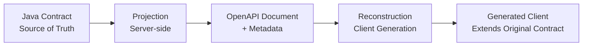

#  Architectural Rationale: Why OpenAPI Generics Exists

**Intended Audience:** Enterprise architects, platform engineers, OpenAPI specification contributors, language tooling maintainers, and teams responsible for API contract governance.

---

## Table of Contents

- [The Enduring Problem](#the-enduring-problem)
- [The Semantic Gap: Language Type Systems vs Structural Schemas](#the-semantic-gap-language-type-systems-vs-structural-schemas)
- [Theoretical Capabilities in OpenAPI 3.1 and JSON Schema 2020-12](#theoretical-capabilities-in-openapi-31-and-json-schema-2020-12)
- [Current State of the Tooling Ecosystem](#current-state-of-the-tooling-ecosystem)
- [Distinguishing Specification, Implementation, and Ecosystem Constraints](#distinguishing-specification-implementation-and-ecosystem-constraints)
- [Why "Waiting for Upstream" Is Often Insufficient for Production Systems](#why-waiting-for-upstream-is-often-insufficient-for-production-systems)
- [Core Architectural Decision](#core-architectural-decision)
- [Why Common Workarounds Are Often Insufficient at Scale](#why-common-workarounds-are-often-insufficient-at-scale)
- [Trade-offs and Deliberate Boundaries](#trade-offs-and-deliberate-boundaries)
- [Position Within the Broader OpenAPI Ecosystem](#position-within-the-broader-openapi-ecosystem)
- [When This Approach Is Appropriate](#when-this-approach-is-appropriate)
- [When This Approach Is Not Appropriate](#when-this-approach-is-not-appropriate)
- [Conclusion](#conclusion)

---

## The Enduring Problem

Large-scale systems built with statically typed languages such as Java frequently standardize response structures using generic envelopes:

```java
ResponseEntity<ServiceResponse<Page<CustomerDto>>> getCustomers(...)
ResponseEntity<ApiResponse<List<OrderDto>>> getOrders(...)
```

A single envelope definition (`ServiceResponse<T>`) combined with different payload types provides consistency for metadata, pagination, and error handling while allowing payload variation. The generic parameter `T` carries type identity that is meaningful to both compilers and developers.

When these contracts are exposed through OpenAPI for client generation, the resulting artifacts often diverge from the original type relationships. Standard generation produces new named schemas for each unique envelope-plus-payload combination. The generated client no longer references the original contract type; it receives a structurally similar but independent definition. Over multiple service boundaries this produces duplicated models, additional mapping layers, and gradual divergence between the authoritative contract and the types consumed by downstream systems.

The problem is therefore not the absence of generic syntax in OpenAPI, but the loss of contract identity and generic relationships when moving between a language type system and an OpenAPI-based client generation pipeline.

---

## The Semantic Gap: Language Type Systems vs Structural Schemas

Java generics provide named, parameterized types whose identity is preserved across compilation units. `ServiceResponse<Page<CustomerDto>>` is understood by the type system as a specific instantiation of a reusable definition. The compiler can enforce relationships, enable reuse, and allow evolution of the envelope independently of individual payloads.

OpenAPI Schema Objects describe structure. Reuse is achieved through `$ref` and composition keywords. These mechanisms operate on concrete schemas rather than on parameterized abstractions that can be bound at different points while retaining a stable named identity.

This difference is fundamental:

- In Java, the identity of `ServiceResponse<T>` is stable even when `T` varies.
- In OpenAPI, each distinct binding of envelope and payload typically results in a distinct schema name unless additional mechanisms are used to express the relationship.

The gap manifests most clearly when generated clients must participate in the same type hierarchy as the original contract (for example, by extending a shared envelope). Without preserved identity, every boundary introduces a new, parallel hierarchy.

---

## Theoretical Capabilities in OpenAPI 3.1 and JSON Schema 2020-12

OpenAPI 3.1 aligned with JSON Schema Draft 2020-12, introducing `$dynamicRef` and `$dynamicAnchor`. These keywords support dynamic scope resolution, allowing a schema to declare extension points whose binding can be supplied by an enclosing context at evaluation time.

In principle, this provides a mechanism to express generic-like behavior within an OpenAPI document: a container schema can declare a dynamic anchor for its type parameter, and a wrapper schema can supply the concrete binding during resolution. This represents a meaningful advance in the expressive power of the specification for use cases involving reusable generic structures.

The specification therefore does not prohibit the expression of generic contract semantics. It provides a path, through dynamic references, that can in theory preserve the necessary relationships.

---

## Current State of the Tooling Ecosystem

As of mid-2026, end-to-end support for using dynamic references to achieve generic contract preservation in production client generation remains incomplete across the dominant tooling chain:

- **Parser and dereferencer behavior.** Implementations handling OpenAPI 3.1 documents continue to exhibit limitations when processing combinations of `$dynamicRef`, `$dynamicAnchor`, and `$id`. Dynamic metadata can be lost during dereferencing cycles, or resolution can produce unexpected scope behavior. These issues affect the availability of the information required for generic reconstruction.
- **Code generation paths.** Standard OpenAPI Generator Java code generation does not contain logic to interpret dynamic references as generic type parameters for the purpose of producing `extends` relationships to shared contract types. The generator produces concrete models or falls back to less precise representations.
- **Framework-level introspection.** Springdoc-openapi, widely used for runtime OpenAPI generation in Spring Boot, performs response type introspection that can lose information about nested generic parameters in certain configurations (for example, when a generic container such as `Page<T>` appears inside another generic envelope). The resulting OpenAPI document may lack sufficient metadata for downstream generic reconstruction.

These limitations are documented in public issue trackers and reflect the current state of multiple independent projects. They are not universal failures of all possible implementations, but they represent the practical experience of organizations using the predominant OpenAPI tooling stack today.

---

## Distinguishing Specification, Implementation, and Ecosystem Constraints

Clear separation of concerns is necessary for accurate analysis:

| Category            | Description                                                                 | Current Relevance to Generic Contract Preservation                  | Primary Remediation Path                  |
|---------------------|-----------------------------------------------------------------------------|---------------------------------------------------------------------|-------------------------------------------|
| **Specification**   | What the OpenAPI and JSON Schema standards define or deliberately omit.     | Dynamic references exist; no native generic type parameter syntax.  | Future specification work.                |
| **Implementation**  | Behavior of a specific parser, dereferencer, or generator.                  | Partial or conservative handling of dynamic references in major implementations. | Contributions to individual projects.     |
| **Ecosystem**       | Emergent behavior from composition of multiple tools and frameworks.        | End-to-end loss of generic relationships across Springdoc → parser → generator paths. | Compatibility layers or coordinated evolution. |

This project operates primarily at the ecosystem level. It accepts the current practical state of specification support and core implementation behavior as the baseline for production use and introduces a deterministic layer that works with existing OpenAPI documents.

---

## Why "Waiting for Upstream" Is Often Insufficient for Production Systems

Organizations maintaining API platforms at scale face several constraints that make indefinite deferral to future upstream improvements difficult to justify:

- **Coordination cost and timeline.** Achieving reliable, end-to-end support for dynamic generic reconstruction requires changes across parsers, dereferencers, multiple language generators, and framework integrations. These projects have independent release cycles, backward-compatibility requirements, and differing priorities. Historical patterns indicate multi-year timelines for comprehensive support.
- **Risk to delivery commitments.** Roadmaps for client SDKs, contract testing, and service evolution cannot be conditioned on the uncertain completion date of cross-project coordination.
- **Heterogeneous environments.** Many organizations operate a mix of code-first and spec-first workflows, multiple client languages, and both Springdoc-generated and manually maintained specifications. A solution that becomes viable only when every component reaches a future state is difficult to adopt incrementally.
- **Need for deterministic behavior today.** Generated clients must produce stable, reproducible output for a given contract and configuration. This property supports diffing, testing, and safe upgrades regardless of when broader toolchain improvements arrive.

These factors do not diminish the value of upstream contributions. They indicate that a pragmatic compatibility layer can provide immediate, reliable behavior while remaining compatible with future improvements in the core tooling.

---

## Core Architectural Decision

The foundational decision is to treat the **Java contract definition as the single source of truth** and the OpenAPI document as a **deterministic, enriched projection** of that contract.

Under this model:

- The authoritative definitions of envelopes, their generic parameters, and payload relationships reside in Java (or a shared contract module).
- OpenAPI documents carry structural schemas plus additional metadata (via vendor extensions) that describe how the projection relates back to the original types.
- Client generation consumes both structure and metadata to produce thin wrappers that extend the original contract types rather than duplicating their internal structure.

This decision inverts the common assumption that the OpenAPI document should be the primary source from which all other representations are derived. It accepts OpenAPI as an excellent interchange and documentation format while recognizing that language-defined generic contracts benefit from preserving their original identity and relationships.

The architecture therefore consists of two phases connected only through the generated OpenAPI document:



See the [Architecture](../architecture/architecture.md) document for the specific responsibilities of each phase.

---

## Why Common Workarounds Are Often Insufficient at Scale

Organizations facing generic contract loss have historically employed several approaches:

- **Per-endpoint concrete DTOs.** Each operation returns a distinct response type. This eliminates generic reuse and increases maintenance burden when envelope structure changes.
- **Manual Mustache template overrides.** Teams customize OpenAPI Generator templates to produce desired wrapper shapes. These overrides are fragile across generator version upgrades, difficult to maintain consistently across teams, and do not address server-side projection loss.
- **Post-processing of generated code.** Scripts or annotation processors modify generated sources after the fact. This approach violates the principle that generated code should not be edited and introduces non-reproducible steps into the build.
- **Fully spec-first workflows with manual generic modeling.** Teams maintain OpenAPI documents by hand and attempt to express generic relationships through composition. This increases the distance between implementation and contract and still requires generator customization for client reconstruction.

These approaches can be effective for small surfaces or short-term needs. At organizational scale—where dozens or hundreds of services share common envelopes and generic containers—they tend to produce accumulating technical debt in the form of duplicated models, mapping layers, and drift between contract intent and generated artifacts.

---

## Trade-offs and Deliberate Boundaries

The chosen architecture accepts several deliberate trade-offs:

- It provides deterministic preservation of contract-owned generic response types and containers across the documented projection and reconstruction pipeline. It does not attempt to handle arbitrarily complex or unregistered generic graphs.
- It introduces a metadata protocol and generator extension rather than modifying core OpenAPI tooling. This reduces coordination requirements and allows independent evolution, at the cost of maintaining the compatibility layer.
- It requires explicit discovery or configuration of contract types on the server side and explicit generator configuration on the client side. It does not perform fully automatic inference of all possible generic structures.
- Generated clients remain thin transport bindings. Application code is expected to depend on the shared contract module rather than on generated wrapper classes directly.
- The approach remains fully compatible with standard OpenAPI consumers that ignore the additional metadata.

The project explicitly does not aim to replace OpenAPI Generator, to provide a general-purpose generic programming system, or to alter runtime serialization behavior.

---

## Position Within the Broader OpenAPI Ecosystem

OpenAPI Generics functions as an **architectural compatibility layer** rather than a replacement for upstream tooling. It sits between contract definitions expressed in Java and the existing OpenAPI generation and consumption toolchain.

- It consumes and produces standard OpenAPI documents.
- It augments those documents with additional metadata that standard tools can safely ignore.
- It extends OpenAPI Generator through its supported extension points rather than forking template sets.
- It can be adopted incrementally: server-side projection can be enabled without changing client generation, and client generation can be adopted without changing server implementation.

This positioning allows organizations to retain their existing investment in OpenAPI tooling while addressing a specific, recurring gap in contract fidelity for generic response types.

---

## When This Approach Is Appropriate

The pattern is most relevant when:

- Shared generic response envelopes form part of the organization's contract surface across multiple services or teams.
- Model duplication, mapping overhead, or contract drift at service boundaries has become a measurable cost.
- Deterministic, reproducible client generation is valued for testing, diffing, and upgrade safety.
- The organization is willing to treat the typed contract module as authoritative and OpenAPI as a derived representation.
- The environment uses Spring Boot with springdoc-openapi, or teams are able to publish equivalent metadata in spec-first workflows.

---

## When This Approach Is Not Appropriate

The approach is less suitable when:

- Generic envelopes are not used or each operation defines structurally unique responses.
- Primary consumers are non-Java clients where reconstruction of Java generic identity provides limited value.
- The organization prefers to treat the OpenAPI document itself as the single source of truth and accepts duplicated models or ongoing template maintenance.
- Complete end-to-end support for dynamic references in the chosen parser and generator stack becomes sufficient for the organization's contract patterns.
- The additional configuration and metadata introduce operational or cognitive overhead disproportionate to the duplication problem being addressed.

---

## Conclusion

The loss of generic contract identity when moving between Java type systems and OpenAPI-based client generation is a consequence of differing design centers: named parametric polymorphism on one side and structural schema description on the other. OpenAPI 3.1 and JSON Schema 2020-12 provide theoretical mechanisms that can express the necessary relationships, yet practical end-to-end support across the dominant tooling chain remains incomplete.

For organizations that must deliver reliable, deterministic client generation and contract fidelity under current conditions, an additional compatibility layer can provide a pragmatic path. By treating the Java contract as the source of truth and OpenAPI as an enriched projection, the architecture documented here preserves contract identity and generic relationships without requiring changes to core specification support or coordinated upgrades across multiple independent projects.

The design makes explicit trade-offs in scope and mechanism. These trade-offs are justified by the need for immediate, reproducible behavior in production environments where model duplication and drift carry accumulating costs. The resulting system is intended to remain compatible with future improvements in upstream tooling while addressing a real and persistent engineering problem today.

Architects evaluating this approach should assess it against the structure of their own contracts, the cost of duplication in their environment, and their willingness to locate contract authority in the typed implementation rather than solely in the generated specification.

---

## References

### Project Documentation

- [Architecture](../architecture/architecture.md)
- [Compatibility & Support Policy](../compatibility.md)
- [Server-Side Adoption](../adoption/server-side-adoption.md)
- [Client-Side Adoption](../adoption/client-side-adoption.md)

### Specifications

- **OpenAPI Specification 3.1.0**  
  https://spec.openapis.org/oas/v3.1.0.html

- **OpenAPI Specification 3.2.0**  
  https://spec.openapis.org/oas/v3.2.0.html

- **JSON Schema Draft 2020-12**  
  https://json-schema.org/draft/2020-12

### Related Projects

- **OpenAPI Generator**  
  https://github.com/OpenAPITools/openapi-generator

- **Swagger Parser**  
  https://github.com/swagger-api/swagger-parser

- **springdoc-openapi**  
  https://github.com/springdoc/springdoc-openapi